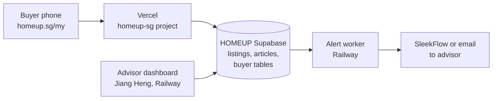
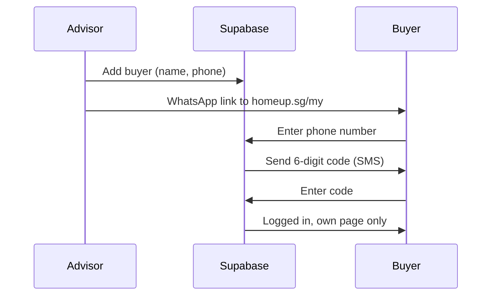

# My HomeUP Buyer Page: Build Brief

2026-09-17 · @Someone

## Purpose and scope

V1 gives every HomeUP buyer a private page on homeup.sg, and every advisor a dashboard that shows which clients need a reply. Design reference: the "My HomeUP Buyer Page" canvas.

It fixes two bottlenecks:

- **Buyers don't tell advisors** when their preferences change or when they spot a unit on PropertyGuru.
- **Advisors don't tell buyers** what they found, thought or decided.

**In V1**

- Buyer pages: Home, My Brief, Discover, Shortlist
- Advisor dashboard: Today queue, Pipeline, Client file, Team health
- Phone login for buyers, email login for advisors
- Advisor alerts when a buyer updates their brief or sends a link

**Not in V1**

- Money planner and sell-and-buy timeline (Phase 3)
- AI suggestions of next listing or next step
- Automatic scraping of pasted PropertyGuru links
- Deal tracker (OTP to completion)

## Decisions before any code

Three decisions must be written down and agreed with Jiang Heng before the build starts. Everything below assumes the recommended option.

| Decision | Recommended | Why | Alternative |
| --- | --- | --- | --- |
| Where buyer data lives | New tables in the HOMEUP Supabase project (`ixhikkbytusikgjiuvqa`) | Buyer login lives there, so privacy rules work natively and there is one source of truth | Buyer data in Jiang Heng's system, reached through his API. Two logins must then trust each other, which adds build work and failure points |
| Who builds what | Website team builds buyer pages on homeup.sg. Jiang Heng builds the advisor dashboard and alerts, reading the same tables | Splits by layer, not journey step, so no client data is duplicated | Jiang Heng builds everything inside his console |
| Pipeline stages | Standby, Nurture, Active, Closed, Not closed (final name to be agreed) | Mirrors the sell-side flow Jiang Heng is already building | None |

Jiang Heng's console must connect with **its own restricted database login**, never the website's keys. His existing propmeta variables must first be removed from the homeup-sg Vercel project.

**Pipeline stage vs journey step.** The stage is internal. Buyers only ever see the journey step.

| Pipeline stage (advisor sees) | Journey step (buyer sees) |
| --- | --- |
| Standby | Brief |
| Nurture | Brief or Shortlist |
| Active | Shortlist, Viewings or Offer |
| Closed | Keys |
| Not closed | Page paused; no step shown |

## How the pieces fit

One database sits in the middle: buyers write to it through homeup.sg, and advisors read and reply through Jiang Heng's dashboard.

Read it left to right: a buyer change lands in Supabase, the alert worker spots it and messages the advisor, and the advisor's reply lands back on the buyer's page.

| Piece | Owner | Hosted on |
| --- | --- | --- |
| Buyer pages (`/my`) | Website team (Tong Boon + Claude Code) | Vercel, homeup-sg project |
| Buyer tables and privacy rules | Website team writes; Jiang Heng reviews | HOMEUP Supabase |
| Advisor dashboard | Jiang Heng | Railway |
| Alert worker (checks for changes, sends messages) | Jiang Heng | Railway |
| Listings, launches, articles | Existing site | HOMEUP Supabase |

All code, Railway and Supabase projects must be owned by HomeUP accounts before work starts.

## Pages and routes

Buyer pages live under `homeup.sg/my` and require login. None of them are indexed by Google.

| Route | Screen | Buyer can | Writes to |
| --- | --- | --- | --- |
| `/my/login` | Login | Enter phone number, then the 6-digit code | Supabase Auth |
| `/my` | Home | See journey step, next viewing, advisor's latest note, new units, articles; share advisor | `referrals` |
| `/my/brief` | My Brief | Change property type, budget, bedrooms, areas, must-haves, deal-breakers, HDB sale, timeline; press Send | `buyer_briefs`, `activity_events` |
| `/my/discover` | Discover | Filter pre-market, HomeUP listings, new launches; save; ask advisor; request viewing | `saved_units`, `advisor_tasks` |
| `/my/shortlist` | Shortlist | Paste a listing link; read advisor's take; rate Love it, Maybe, Pass | `shortlist_items`, `activity_events` |
| `/my/privacy` | Privacy | See what is tracked; turn tracking off | `buyers.tracking_consent` |

Advisor screens are built by Jiang Heng in his dashboard, not on homeup.sg. See "Advisor dashboard" below.

**Existing pages to reuse:** listing detail pages, article pages and the planned private listings page. Pre-market units on Discover come from the same source as the private listings page, so that page and this one share one build.

## Data tables

Nine new tables. Think of each as a spreadsheet tab: one row per item, and each row is tagged with the buyer it belongs to so privacy rules can filter it.

| Table | One row is | Key fields | Buyer can | Advisor can |
| --- | --- | --- | --- | --- |
| `advisors` | An advisor | name, CEA registration no., phone, email, role, active | Read own advisor's name and photo | Read all; admin edits |
| `buyers` | A buyer client | name, phone, advisor\_id, pipeline\_stage, journey\_step, tracking\_consent, created\_at | Read own row only | Read and edit own clients; manager reads all |
| `buyer_briefs` | One version of a brief (never overwritten) | buyer\_id, property\_types, max\_budget, bedrooms, regions, areas\_text, must\_haves, deal\_breakers, selling\_hdb\_first, timeline, sent\_at, seen\_by\_advisor\_at | Create new versions; read own | Read; mark seen |
| `shortlist_items` | A unit on a buyer's shortlist | buyer\_id, source (HomeUP or pasted link), listing\_id or url, status, advisor\_take, buyer\_rating, updated\_at | Add links; set rating; read own | Set status and take |
| `saved_units` | A unit a buyer hearted on Discover | buyer\_id, listing\_id or launch\_id, saved\_at | Create, delete, read own | Read |
| `viewings` | A booked viewing | buyer\_id, shortlist\_item\_id, date\_time, status, buyer\_feedback, advisor\_feedback | Read own; add feedback | Create, edit |
| `activity_events` | Something a buyer did | buyer\_id, event\_type, target\_id, created\_at | Create only (through the site) | Read |
| `advisor_tasks` | A follow-up owed to a buyer | buyer\_id, advisor\_id, task\_type, due\_at, done\_at, reply\_text | Read reply\_text once done | Create, tick done |
| `referrals` | A friend introduced by a buyer | referrer\_buyer\_id, friend\_name, friend\_phone, status | Create, read own | Read, edit |

**Rules for the coder**

- Every table has row-level security switched on before any data goes in.
- A brief is never edited in place. Each Send creates a new version, so the advisor can see exactly what changed.
- `activity_events` only records events when `tracking_consent` is true.
- New launches: use the existing listings table if it can hold a launch; otherwise add a `new_launches` table. Stage 0 must check.

## Login flow

Buyers log in with their phone number and a one-time code, and only phone numbers an advisor has added can get in.

**Buyers**

- Supabase Auth, phone number plus one-time code. Code delivery needs an SMS provider such as Twilio, which charges per message.
- Invite-only: public sign-up is switched off. A phone number not in `buyers` gets a polite "ask your advisor" message.
- Stay logged in for 30 days on the same phone so buyers aren't asked for codes every visit.
- Fallback if the code doesn't arrive: advisor resends the link, or the buyer uses an email login link.

**Advisors**

- Email login in Jiang Heng's dashboard, checked against the same Supabase Auth.
- Access level comes from `advisors.role`: advisor sees own clients; manager sees all clients and Team health.
- Leaving advisors are set to inactive the same day, which locks them out and flags their clients for reassignment.

## Advisor dashboard

The dashboard's job is to make an unanswered buyer impossible to miss. Design reference: the "What the advisor sees" screens on the canvas.

| Screen | Who | Shows |
| --- | --- | --- |
| Today | Advisor | One queue of everything owed across all clients, overdue first; today's viewings; hot signals |
| Pipeline | Advisor, manager | Clients as cards in Standby, Nurture, Active, Closed, Not closed; drag to change stage |
| Client file | Advisor | Brief with changes highlighted, shortlist, viewings, activity, follow-ups, deal opportunities |
| Team health | Manager | Per advisor: open follow-ups, overdue, median reply time, quiet clients |
| Phone view | Advisor | Today queue on a phone, with one-tap WhatsApp |

**What creates a follow-up task** (reply times are proposals to confirm)

| Buyer action | Task created | Due within |
| --- | --- | --- |
| Sends a brief update | Review brief and send matches | 24 hours |
| Pastes a listing link | Post advisor's take on the link | Same working day |
| Asks about a unit | Reply to question | 4 working hours |
| Requests a viewing | Confirm or propose a time | 4 working hours |
| Viewing date passes | Post take and ask for rating | 24 hours after viewing |

**Signals (no task, just a flag)**

- **Hot:** same unit opened 3 or more times in 7 days.
- **Quiet:** no buyer activity for 14 days. Suggest a nudge.
- **Sell-side lead:** brief says "selling HDB first". Suggest handover to an HDB selling advisor.

**Closing a task posts to the buyer.** Ticking a task done requires a short reply, which appears on the buyer's page. This is what makes advisors keep buyers informed.

## Guardrails (non-negotiable)

A breach of any rule below blocks the merge, however good the rest of the work is.

| Area | Rule | How it is checked |
| --- | --- | --- |
| Privacy between buyers | Row-level security on every new table; a buyer reads only rows tagged with their own id | Two test buyers on the preview: Buyer A must see zero of Buyer B's rows on every page |
| Caching | The sitewide `no-store` HTML policy in `next.config.mjs` stays. No caching, `revalidate` or static generation on any `/my` page | Stage 0 lists every caching setting touched |
| Cloudflare | All homeup.sg records stay grey cloud (DNS only) | No DNS changes in this build |
| Search engines | `/my` pages are `noindex` and excluded from the sitemap | View page source on preview |
| Keys | Service role key never in browser code, never in a synced folder; Jiang Heng uses his own restricted database login | Search the built code for the key name |
| Terminology | HomeUP is an advisory, never an agency; no "specialist" | `scripts/check-cea-terminology.mjs` passes, with `app/my/` added to its scan |
| PDPA | Buyers are told what is tracked on first login and can turn it off at `/my/privacy`; data deleted on request | Consent screen present on preview |
| Pre-market units | Shown only when the seller's consent to market is recorded against the listing | Listing without consent does not appear on Discover |
| PropertyGuru links | Store the link only. No scraping from Vercel; PropertyGuru blocks server traffic | No outbound calls to PropertyGuru in the code |
| Claims | No rankings or statistics on buyer pages unless they meet the verified claim standard | Content review before merge |

## Build phases

Phase 1 fixes the two bottlenecks on its own, so it ships first and gets used by real buyers before anything else is built.

| Phase | Website team builds | Jiang Heng builds | Done when |
| --- | --- | --- | --- |
| 0. Prepare | Remove propmeta variables from homeup-sg Vercel; agree the three decisions | Move repo, Railway and Supabase to HomeUP accounts | Ownership confirmed in writing; decisions table signed off |
| 1. Brief and Shortlist | Tables with privacy rules, buyer login, `/my/brief`, `/my/shortlist`, `/my/privacy` | Today queue, Client file, alerts for brief updates and pasted links | 3 real buyers using it; every update gets an advisor reply inside its due time for 2 weeks |
| 2. Discover and Home | `/my`, `/my/discover` with pre-market, HomeUP listings, new launches, articles | Pipeline board, viewings with feedback, phone view | Advisors stop sending listing screenshots on WhatsApp |
| 3. Grow | Referrals, money planner, sell-and-buy timeline | Team health, hot and quiet signals, sell-side handover | Manager reviews Team health weekly |

Each phase is built on its own branch, checked on the Vercel preview link, and merged by Tong Boon only.

## Stage 0 and controls for Claude Code

Claude Code must stop after Stage 0 and wait for Tong Boon's written go-ahead before changing any file.

**Three controls (apply to every phase)**

1. Stop before editing: report Stage 0 findings first.
2. No database writes by the agent: table changes are written as migration files for Tong Boon to review and run.
3. No merging: open a pull request against `master` and stop.

**Stage 0 report must cover**

1. Which existing tables hold listings, articles and new launches, and whether a launch fits the listings table.
2. How login currently works on the site (admin users) and whether phone login can sit alongside it.
3. Every file that touches caching, middleware or `next.config.mjs` that this build would affect.
4. Whether `scripts/check-cea-terminology.mjs` can scan `app/my/`.
5. The full list of new files, changed files and migration files planned for this phase.
6. Any conflict with the guardrails table, stated plainly.

**Working folder:** `C:\Users\PC\Documents\GitHub\homeup.sg`, default branch `master`. Save this brief to `docs/briefs/` before starting.

## Version 3: one board that follows the stage

The search pages and the live offer board are one product, not two. The buyer keeps the same link and login all the way through, and `buyers.journey_step` decides which block sits at the top and which tabs show. Design reference: the "V3 One board that follows the stage" artboard.

| Stage | Starts when | Top of the board | Tabs |
| --- | --- | --- | --- |
| Searching | The buyer sends a brief | Live filtering project with a finish time; new matching units | Home, Discover, Shortlist, Brief |
| Viewing | The first viewing is booked | Next viewing with a countdown and viewing pack; rate what you saw | Home, Discover, Shortlist, Brief |
| Offer | The advisor sets the deal status to "Preparing offer" | Negotiation card with hourglass, waiting time and next update time; counter instruction; while-you-wait reads | Home, Deal room, Shortlist, Brief |
| Closing | The Option to Purchase is issued | Exercise deadline countdown; loan, lawyer and CPF checklist | Home, Deal room, Checklist, Brief |

**Rules for the coder**

- Only the advisor's action moves the stage. The buyer never switches modes.
- Each switch shows one banner on the buyer's board, for example "Your board switched to offer mode".
- Nothing is removed. In Offer, the rest of the shortlist shows as "3 other units on hold". If the offer falls through, the stage returns to Viewing with the shortlist intact.
- My Brief, the journey bar, the latest update and "message advisor" appear at every stage.

**Two more tables**

| Table | One row is | Key fields |
| --- | --- | --- |
| `deals` | An offer on one unit | buyer\_id, listing\_id, unit\_label, offer\_price, status (drafting, sent, awaiting\_reply, counter, accepted, otp\_issued, lapsed), next\_update\_due, advisor\_note, updated\_at |
| `projects` | A piece of work the buyer can watch | buyer\_id, title, owner\_advisor\_id, criteria (text list), counts (scanned, matched, checked, ready), progress\_percent, eta\_text, status (queued, in\_progress, done), visible\_to\_client |

**The promise field matters most.** Every `next_update_due` creates an advisor task with that deadline. If the deadline passes without a reply, the item turns red on Today and on Team health. A board that promises an update and delivers nothing is worse than no board.

**Where this sits in the phases.** Phase 1 stays as it is. The stage logic, `deals` and `projects` become Phase 2, replacing "Discover and Home" as the second release, because the offer stage is where buyers get anxious. Discover, referrals and the calculators move to Phase 3.

**Honest limits**

- The project counts (scanned, matched, ready) need a real listings source your team filters. Until then an admin types them in, which works for a handful of buyers only.
- Keep advisor notes about the seller side general. Buyers may screenshot the board and forward it.

## Open questions

- [ ] Does Jiang Heng agree buyer data lives in the HOMEUP Supabase project?
- [ ] Is his current "buy front end page" client-facing or for agent data entry?
- [ ] Final name for the "Not closed" stage.
- [ ] Which SMS provider sends login codes, and the monthly budget for it.
- [ ] Are the proposed reply times in the follow-up table right for the team?
- [ ] Who is "manager" in Team health: Tong Boon only, or Dennis too?
- [ ] How is seller consent for pre-market units recorded today?
- [ ] Real HomeUP logo and brand colours to replace the prototype look.
